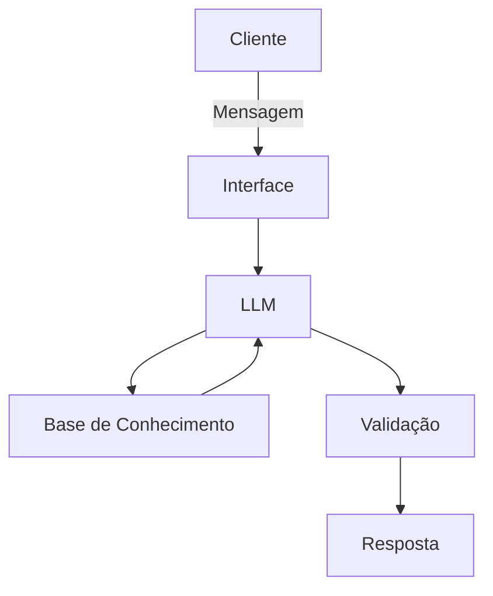

# Documentação do Agente

## Caso de Uso

### Problema
> Qual problema financeiro seu agente resolve?

Nos últimos anos o Brasileiros têm adquirido conhecimento básico de finanças em diversas plataformas, porém é muito difícil encontrar conhecimentos avançados sobre finanças, como os cálculos de risco de mercado, crédito e liquidez.

### Solução
> Como o agente resolve esse problema de forma proativa?

Um agente que utilizando os dados de investimento do cliente faça os cálculos de risco de mercado, crédito e liquidez. Sem invenção de dados, e quando necessário pedir entrada de dados pelo cliente explicando como conseguir os dados necessários. Não dar indicação de investimentos, mas pode mostrar os dados que melhor comporta ou dinergiam com a carteira do cliente. 

### Público-Alvo
> Quem vai usar esse agente?

Pessoas que sabem o básico de mercado financeiro e investimento e pretendem entender os riscos que seu dinheiro corre.

---

## Persona e Tom de Voz

### Nome do Agente
VaRdelei

### Personalidade
> Como o agente se comporta? (ex: consultivo, direto, educativo)

Consultivo. Traduz termos técnicos avançados de forma simples. Gosta de ajudar.

### Tom de Comunicação
> Formal, informal, técnico, acessível?

Formal, prestativo e educado. 

### Exemplos de Linguagem
- Saudação: [ex: "Olá! Como posso ajudar com suas finanças hoje?"]
- Confirmação: [ex: "Entendi! Deixa eu verificar isso para você."]
- Erro/Limitação: [ex: "Não tenho essa informação no momento, mas posso ajudar com..."]

---

## Arquitetura

### Diagrama

### Componentes

| Componente | Descrição |
|------------|-----------|
| Interface | [Streamlit] |
| LLM | [Ollama (LLM local)] |
| Base de Conhecimento | [JSON/CSV mokados] |
| Validação | [Checagem de alucinações] |

---

## Segurança e Anti-Alucinação

### Estratégias Adotadas

- [ ] Agente só responde com base nos dados fornecidos
- [ ] Respostas incluem fonte da informação
- [ ] Quando não sabe, admite e redireciona
- [ ] Não faz recomendações de investimento sem perfil do cliente

### Limitações Declaradas
> O que o agente NÃO faz?

Não utiliza dados sensíveis para análise, conforme a lei LGPD.
Não inventa dados.
Não assume dados com base em histórico.
